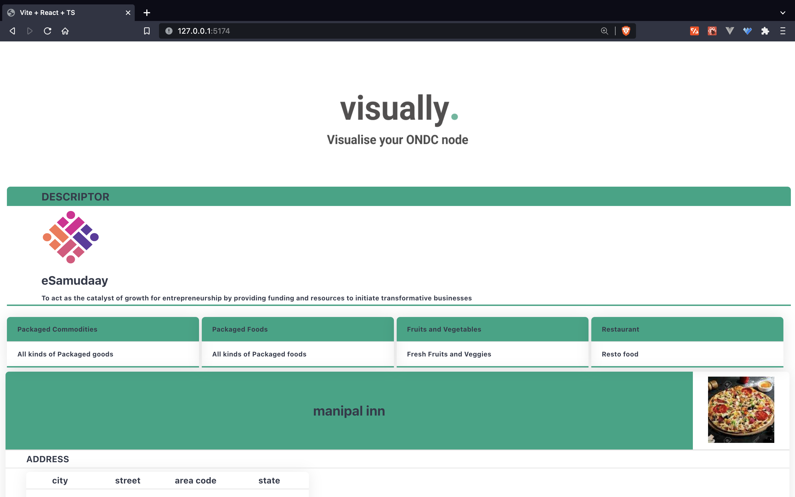
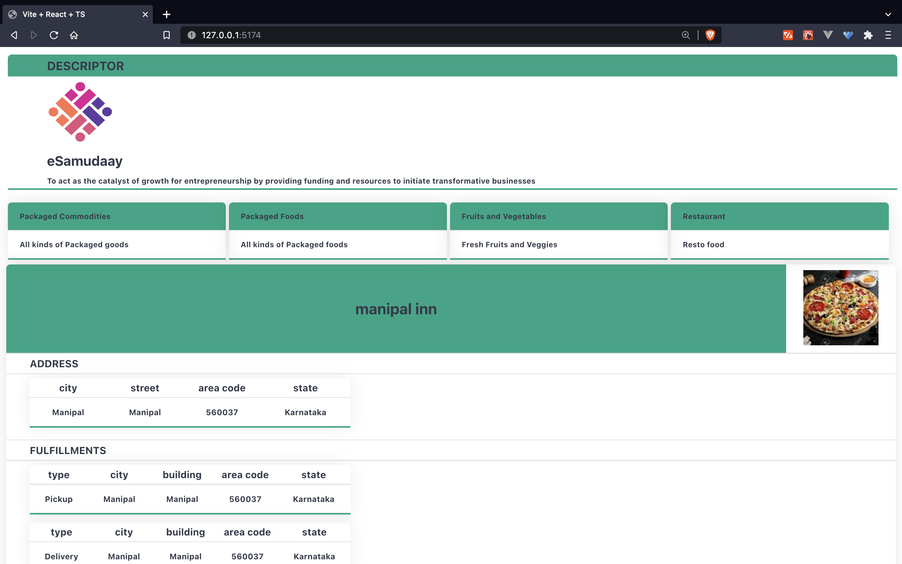
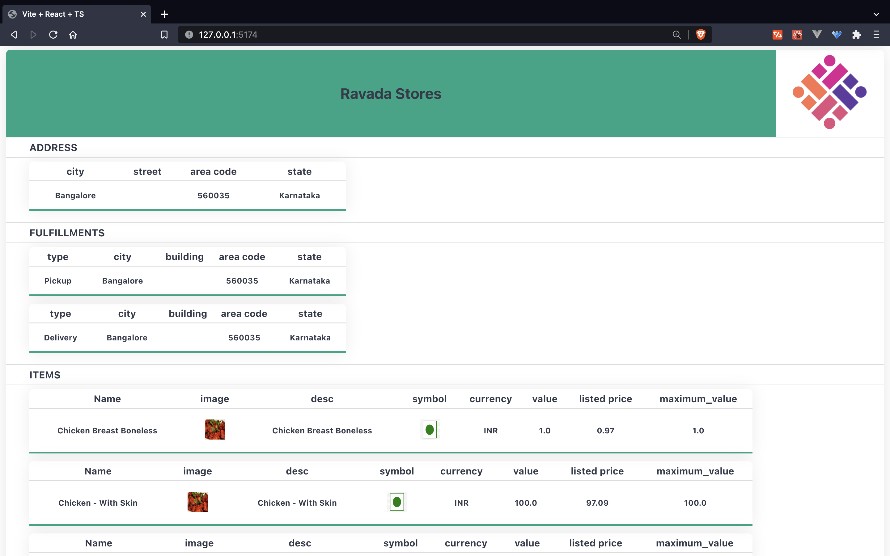

[![Contributors][contributors-shield]][contributors-url]
[![Forks][forks-shield]][forks-url]
[![Stargazers][stars-shield]][stars-url]
[![Issues][issues-shield]][issues-url]
[![MIT License][license-shield]][license-url]
[![Twitter][twitter-shield]][twitter-url]

 

  

  <h3 align="center">visually.</h3>

  

web app that helps visualise compliance!
     
    <a href="https://github.com/ankit-v2-1/xe50"><strong>Explore the docs »</strong></a>
     
     
    <a href="https://github.com/ankit-v2-1/xe50">View Demo</a>
    ·
    <a href="https://github.com/ankit-v2-1/xe50/issues">Report Bug</a>
    ·
    <a href="https://github.com/ankit-v2-1/xe50/issues">Request Feature</a>
  

## Description
Submission of eSamudaay Hackathon22.

Problem Statements 1.

Make a search call to eSamudaay’s backend and receive an on_search callback. This result needs to be processed and a compliance report needs to be prepared to be visually displayed to necessary stakeholders.

Rubric for Evaluation:

1. Team should successfully make a search call and receive an on_search callback.
2. All the products and providers in the on_search callback need to be checked for compliance.
3. Compliance needs to be displayed in a useful way

## Preview
### Descriptor. 

## Preview
### Descriptor. 

| ------ |

### Categories. 

| ------ |

### Providers.  

| ------ |

<!-- MARKDOWN LINKS & IMAGES -->
<!-- https://www.markdownguide.org/basic-syntax/#reference-style-links -->
[contributors-shield]: https://img.shields.io/github/contributors/ankit-v2-1/xe50.svg?style=for-the-badge
[contributors-url]: https://github.com/ankit-v2-1/xe50/graphs/contributors
[forks-shield]: https://img.shields.io/github/forks/ankit-v2-1/reframe.svg?style=for-the-badge
[forks-url]: https://github.com/ankit-v2-1/xe50/network/members
[stars-shield]: https://img.shields.io/github/stars/ankit-v2-1/xe50.svg?style=for-the-badge
[stars-url]: https://github.com/ankit-v2-1/xe50/stargazers
[issues-shield]: https://img.shields.io/github/issues/ankit-v2-1/xe50.svg?style=for-the-badge
[issues-url]: https://github.com/ankit-v2-1/xe50/issues
[license-shield]: https://img.shields.io/github/license/ankit-v2-1/reframe.svg?style=for-the-badge
[license-url]: https://github.com/ankit-v2-1/reframe/blob/dev/LICENSE
[twitter-shield]: https://img.shields.io/twitter/follow/ankit_v2_1?style=for-the-badge&color=09f&labelColor=black.svg&logo=twitter&label=@ankit_v2_1
[twitter-url]: https://twitter.com/ankit_v2_1